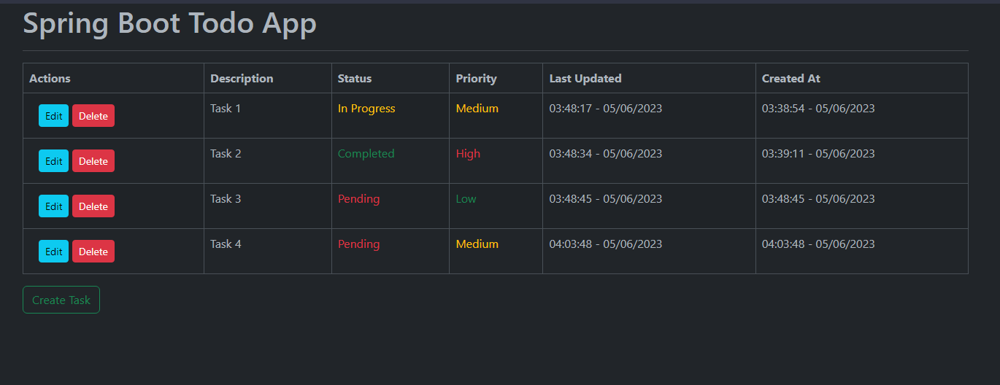

# SpringBoot Todo App
A simple fullstack todo app with CRUD operations and REST API endpoints.

  

    Table of Contents

- [**Introduction**](#introduction)
- [**Thymeleaf Endpoints**](#thymeleaf-endpoints)
    - [Home Page](#home-page)
    - [Create new Todo Item](#create-new-todo-item)
    - [Edit existing Todo Item](#edit-existing-todo-item)
    - [Delete Todo Item](#delete-todo-item)

- [**REST API Endpoints for Todo Items**](#rest-api-endpoints-for-todo-items)
    - [Get all todo items](#get-all-todo-items)
    - [Get a specific todo item by ID](#get-a-specific-todo-item-by-id)
    - [Create a new todo item](#create-a-new-todo-item)
    - [Update an existing todo item](#update-an-existing-todo-item)
    - [Delete a todo item by ID](#delete-a-todo-item-by-id)

## Introduction
This is a simple todo app built with SpringBoot and Thymeleaf. It uses a file based [H2 database](/data/)
to store the todo items. It also uses [Bootstrap](https://getbootstrap.com/) for CSS. I built this app to learn SpringBoot and Thymeleaf.

## Thymeleaf Endpoints
The app is deployed at `PORT:8080`

Thymeleaf endpoint is at `/`

### Home Page
- URL: `/`
- Description: Displays a list of all `todo items`.

### Create new Todo Item
- URL: `/create-todo`
- Description: Displays a form to create a new `todo item`.

### Edit existing Todo Item
- URL: `/todo/edit/{id}`
- Description: Displays a form to edit an existing `todo item`.

### Delete Todo Item
- URL: `/todo/delete/{id}`
- Description: Deletes an existing 'todo item'.

## REST API Endpoints for Todo Items

This is an overview of the REST endpoints available for managing todo items. These endpoints allow you to perform CRUD (Create, Read, Update, Delete) operations on todo items.

Base URL: `/api/v1/todo-items`

### Get all todo items
- URL: `/`
- Method: GET
- Description: Retrieves a list of all todo items.
- Response: Returns a list of `TodoItem` objects.

### Get a specific todo item by ID
- URL: `/{id}`
- Method: GET
- Description: Retrieves a specific todo item based on its ID.
- Path Variable:
    - `id` (Long): The ID of the todo item.
- Response: Returns the `TodoItem` object with the specified ID.

### Create a new todo item
- URL: `/`
- Method: POST
- Description: Creates a new todo item.
- Request Body: Provide a JSON object representing the `TodoItem` to be created. The request body should be in a valid format and include all required fields.
- Response: Returns the created `TodoItem` object.

### Update an existing todo item
- URL: `/{id}`
- Method: PUT
- Description: Updates an existing todo item with the specified ID.
- Path Variable:
    - `id` (Long): The ID of the todo item to be updated.
- Request Body: Provide a JSON object representing the updated `TodoItem`. The request body should be in a valid format and include all required fields.
- Response: Returns the updated `TodoItem` object.

### Delete a todo item by ID
- URL: `/{id}`
- Method: DELETE
- Description: Deletes a specific todo item based on its ID.
- Path Variable:
    - `id` (Long): The ID of the todo item to be deleted.
- Response: Returns the deleted `TodoItem` object.

Note: The endpoints expect and return data in JSON format. Make sure to include appropriate headers and follow RESTful practices when making requests to these endpoints.
